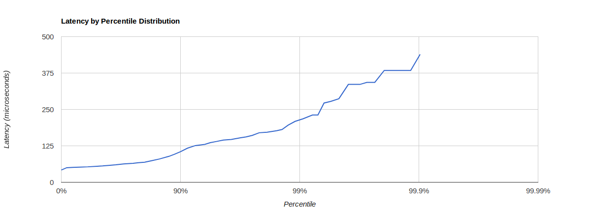

# Go [smf - the fastest RPC in the West](https://github.com/smfrpc/smf/)

Go implementation of [smf - the fastest RPC in the West](https://github.com/smfrpc/smf/), not as fast as original; with little chance of being so.

## References

* [Main Repository](https://github.com/smfrpc/smf) - smf source code
* [Official Documentation](https://smfrpc.github.io/smf/) - smf documentation

## License

                                 Apache License
                           Version 2.0, January 2004
                        http://www.apache.org/licenses/
